<a href="https://github.com/kazimanilaydin">
  
</a>

<p align="center">
  <a href="https://www.linkedin.com/in/kazimanilaydin"></a>
  <a href="https://medium.com/@kazimanilaydin"></a>
</p>

<p align="center">
  
</p>



<details>
<summary><code>❯ cat anil.config.js</code></summary>

```javascript
const anil = {
  name: "Kazım Anıl Aydın",
  nick: "kazimanilaydin",
  motto: ["Think & Do", "levántarse y brillar"],
  roles: ["Engineer", "Developer", "Thinker"],
  education: ["Ordu Uni.", "19 Mayıs Uni.", "Amasya Uni.", "Vilnius Uni."],
  stack: {
    frontend: ["JavaScript", "TypeScript", "Vue", "Nuxt", "React"],
    backend: ["Node.js", "Express", "Python", "Flask", "Go"],
    data: ["MySQL", "PostgreSQL", "MongoDB", "R", "Jupyter"],
    systems: ["macOS", "Windows", "Linux", "Git", "Bash"],
  },
  interests: ["AI", "Data Mining", "Robotics", "Cryptography", "Electronics"],
  hobbies: ["Coding", "Music", "Movies", "Travel"],
  status: "🐇 Follow the white rabbit",
};
```

</details>

<br />


<br />
<br />



<br />
<br />

<picture>
  <source media="(prefers-color-scheme: dark)" srcset="https://raw.githubusercontent.com/kazimanilaydin/kazimanilaydin/output/snake-dark.svg" />
  
</picture>

<br />
<br />


